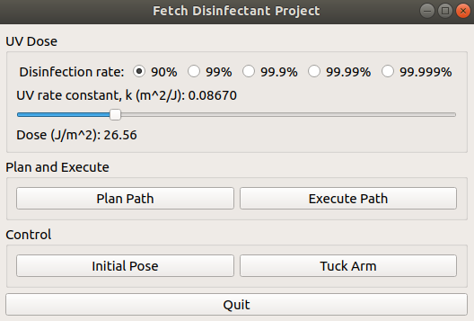

# fetch-disinfectant-project

## Install

### Install dependencies
Install the necessary packages to run a simulation environment with a fetch robot.

```
sudo apt-get update
sudo apt-get install ros-molodic-fetch*
```

You also need to install the rviz_visual_tools for the cone marker. Further information [here](https://github.com/PickNikRobotics/rviz_visual_tools/blob/melodic-devel).
```
sudo apt-get install ros-melodic-rviz-visual-tools
```

The octomap dependencies need to be installed.
```
sudo apt-get install ros-melodic-octomap
sudo apt-get install ros-melodic-octomap-server
sudo apt-get install ros-melodic-octomap-mapping
```

You also need to pip and pip3 install:
* rospkg
* scipy
* sympy
* planar
* pyvista
* PyQt5


### Build
Add the package to your src file in your workspace.

```
git clone https://github.com/osuprg/fetch_disinfectant_project.git
cd ~/catkin_ws/
catkin_make
source devel/setup.bash
```

## Planar Disinfection
Run the below launch files and python node into separate terminals to get things started.

```
roslaunch fetch_disinfectant_project_moveit_config fetch_world.launch
```
```
roslaunch fetch_disinfectant_project_moveit_config disinfectant_project.launch
```
```
rosrun teleop_twist_keyboard teleop_twist_keyboard.py
```
Click on the publish point feature and then click on one of the cubes in the octomap. This should populate an interactive marker at the location of the cube.


Once you have at least three (four preferred) markers up,  you will see a plane marked by these points and a lawnmower path defined by this plane at a height offset.

### Using the GUI

* Select "Plan Path" when you're ready with the lawnmower path and there are no collision error messages
* Select "Execute Path" if the planned path succeeds without any errors
* Select "Initial Pose" to take the arm to the initial position.
* Select "Tuck Arm" to take the arm back to its home position.


## Non-planar Disinfection
Run the below launch files and python node into separate terminals to get things started.
```
roslaunch fetch_disinfectant_project_moveit_config short_table_gazebo.launch
```
```
roslaunch fetch_disinfectant_project_moveit_config nonplanar_disinfection.launch
```
```
rosrun teleop_twist_keyboard teleop_twist_keyboard.py

```

Select *Initial Pose* on the menu. This will allow the fetch to have an arm configuration that is more ideal before planning and executing a planned path.

In three separate terminals, run the following python nodes:
```
rosrun fetch_disinfectant_project_moveit_config head_movement.py
```
```
rosrun fetch_disinfectant_oject_moveit_config pcl_filter.py
```
```
rosrun fetch_disinfectant_project_move_config nonplanar_waypoint_generator.py
```

Similar to the planar disinfection section, click on the publish point feature on the top toolbar of RViz. Then click on one of the cubes in the octomap. This should populate an interactive marker at the location of the cube.


Once you have at least three (four preferred) markers up,  you will be able to see an arrow marker of the tool path.


Then select the *Plan Path* button. If the planned trajectory behaves as desired, then select the *Execute Path* button. Once the path is complete, return the arm configuration by clicking on the *Initial Pose* button.

