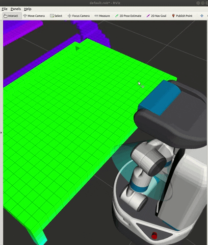
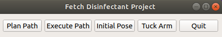

# fetch-disinfectant-project

## Install

### Install dependencies
Need to install the rviz_visual_tools for the cone marker. Futher information [here](https://github.com/PickNikRobotics/rviz_visual_tools/blob/melodic-devel).
```
sudo apt-get update
sudo apt-get install ros-melodic-rviz-visual-tools
```

The octomap dependencies need to be installed.
```
sudo apt-get install ros-melodic-octomap
sudo apt-get install ros-melodic-octomap-server
sudo apt-get install ros-melodic-octomap-mapping
```

You also need to pip3 install:
* rospkg
* scipy
* sympy


### Build
Add the package to your src file in your workspace.

```
git clone https://github.com/osuprg/fetch_disinfectant_project.git
cd ~/catkin_ws/
catkin_make
source devel/setup.bash
```

### Get started
Run launch files to get things started.

```
roslaunch fetch_disinfectant_project_moveit_config fetch_world.launch
roslaunch fetch_disinfectant_moveit_config disinfectant_project.launch
roslaunch fetch_disinfectant_moveit_config run_nodes.launch
rosrun teleop_twist_keyboard teleop_twist_keyboard.py
```
Click on the publish point feature and then click on one of the cubes in the octomap. This should populate an interactive marker at the location of the cube.



Once you have at least three (four preferred) markers up,  you will be able  to see a plane marked by these points and also a lawnmower path defined by this plane, at a height offset.

### Using the GUI

* Select "Plan Path" when you're ready with the lawnmower path and there are no collision error messages
* Select "Execute Path" if the planned path succeeds without any errors
* Select "Initial Pose" to take the arm to the initial position.
* Select "Tuck Arm" to take the arm back to its home position.
